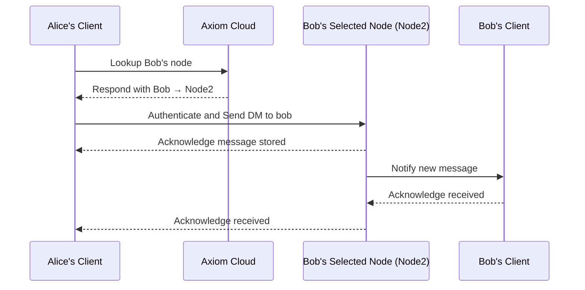
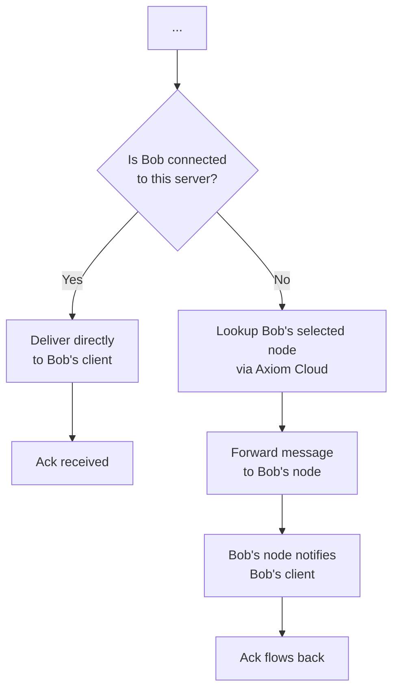
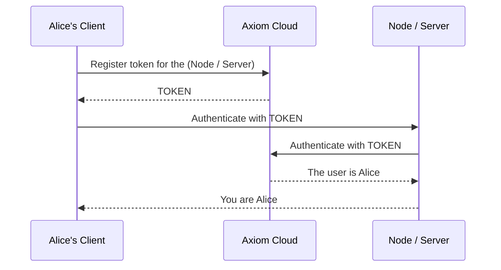

<h1 align="center">
  <br>
  <a href="https://vxchat.netlify.app/"></a>
</h1>

<h4 align="center">Chat. Connect. Collaborate.</h4>

<p align="center">
  <a href="#setup">Setup</a> •
  <a href="#features">Features</a> •
  <a href="#keywords">Keywords</a> •
  <a href="#node-structure">Node Structure</a> •
  <a href="#server-structure">Server Structure</a> •
  <a href="#authentication-handshake">Authentication</a>
  <!-- • <a href="#wiki">Wiki</a> •
  <a href="#contributing">Contributing</a> •
  <a href="#credits">Credits</a> •
  <a href="#support">Support</a> •
  <a href="#sponsor">Sponsor</a> •
  <a href="#license">License</a> -->
</p>

## Setup

### Requirements

- Node.Js with npm
- Supabase

```python
NEXT_PUBLIC_SUPABASE_URL=""
SUPABASE_SERVICE_ROLE_KEY=""
```

## Features

- Private: Messages can be handled by the server / node, axiom can't access them.
- Customizable: Customize your server with plugins, a replacement for bots.

## Keywords

- Axiom Client: The user-side app which communicates with all below.
- Axiom Cloud: The authentication and user management handler.
- Axiom Server: The self-host-able community/friends communication service.
- Axiom Node: The self-host-able Private Message communication service, also used for sending notifications.

## Node Structure

The Direct-Message structure works like Email, but real-time and the node uses a temporary auth, a node is what stores messages that are sent by a user.

This diagram shows that in order to send a message to a user, you must connect to their chosen node, which can be accessed via the Axiom Cloud and connected to directly.

A node message can be a DM (Direct Message between two parties), or a SM (Server Message from a community).



## Server Structure

Let's say Alice sends a message in `general`, this is how the server handles it



## Authentication handshake

This sequence happens when you connect to a server or node.



### Edge cases:

<details>
<summary>The server doesn't send the user id (or the proper user ID) to the client</summary>

1. The server is compromised / has evil intents
2. The token is compromised / client has evil intents

</details>

<details>
<summary>The client or server fail to handle the protocol or handshake</summary>

1. The server is likely outdated and lacks maintenance
2. The client is likely outdated and lacks maintenance

</details>

All of these edge cases don't have the fact written, but each edge case can be induced by a bug or 3rd party not necessarily implicating evil intents.
